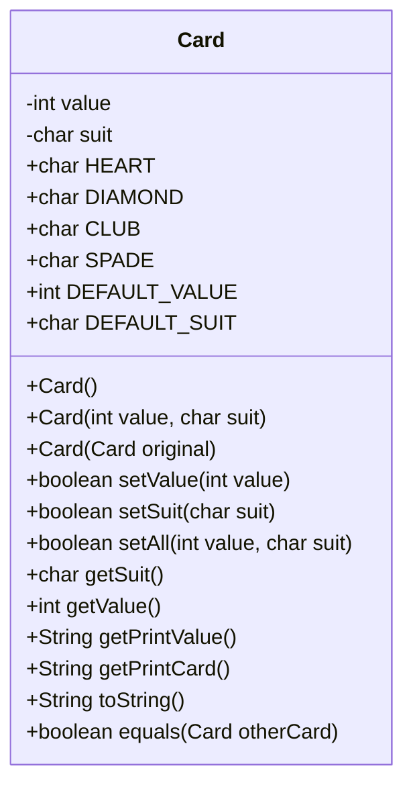

# Final Project: UML, Classes, and Objects

The goal of this phase of the project is to design classes and objects for your final project using UML class diagrams, then implement and test at least one concrete Java class.

## UML Class Diagram

Use the resources below to create a UML class diagram of a class that you will use in your final project and place the UML diagram here.

### Mermaid
[Mermaid](https://mermaid.ai/open-source/syntax/classDiagram.html) allows users to create UML diagrams—such as flowcharts, sequence, class, and state diagrams, quickly using text. Here is is an example of the `Card` class that we created in a previous lab. Place your concrete class in the `src/` folder.
The following code:
```

Renders like this


### Alternative UML Tools

The following UML tools are also recommended:

- [PlantUML](https://plantuml.com/class-diagram)
- [Draw.io / diagrams.net](https://app.diagrams.net/)
- [Lucidchart](https://lucid.co)
- [Visual Paradigm](http://visual-paradigm.com/)

## Concrete Class
Create a concrete class, which you will use in your final project and from which you can create objects (instances). Place your concrete class in the `src/` folder.

## Tester Class
Create a tester class with a `main` method, in which you will create objects of your concrete class and test each of its methods. Place your tester class in the `src/` folder.
